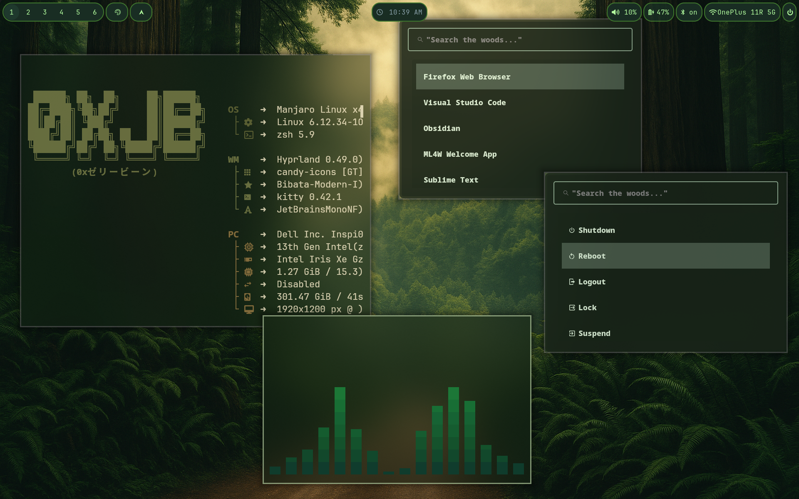

# dotfiles

Personal configuration files for my daily Linux desktop – tuned for a Wayland (Hyprland) workflow on Arch/Manjaro.

> "Keep your tools close and your configs closer."

---
## Wallpapers

[wallpapers](wallpapers/wallz.md)

## ✨ Features

• Hyprland tiling Wayland compositor with custom gaps, animations and per–monitor rules  
• Waybar status bar styled with CSS  
• Kitty terminal with a minimal, true-color theme  
• Oh-My-Zsh shell powered by Oh-My-Posh prompts and useful aliases  
• Fastfetch/neofetch ASCII logo and rich system info preset  
• Neovim configured with **lazy.nvim** plugin manager  
• Tmux with TPM, Resurrect & Continuum (submodules)  
• Pywal templates and GTK 2/3/4 themes for coherent colors  
• Wofi launcher, Cava audio visualiser and a curated wallpaper pack

---

## 📦 Directory layout

```
./
├── zsh/            # .zshrc, functions, aliases and Oh-My-Zsh
├── poshthemes/     # Oh-My-Posh themes (foresttrail.omp.json)
├── hypr/           # Hyprland + Hyprlock configuration
├── waybar/         # Waybar config & style sheet
├── kitty/          # Kitty terminal config
├── nvim/           # Neovim (Lua) config with lazy-lock.json
├── tmux/           # Tmux config (.tmix.conf) + plugins (TPM, Continuum)
├── fastfetch/      # Fastfetch JSONC preset & logo
├── wal/            # Pywal templates / colorschemes
├── wofi/           # Wofi launcher style & config
├── cava/           # Cava visualiser settings
├── gtk-{2,3,4}.0/  # GTK themes overrides
├── wallpapers/     # A few favourite wallpapers
└── neotxt/         # ASCII banner used by fastfetch
```

---

---

## 🔧 Dependencies

The `install.sh` script takes care of everything on Arch-based systems, but if you prefer to do things manually (or use another distro) you'll need:

• hyprland, hyprlock, swayidle, swww  
• waybar, wofi, dunst  
• kitty, fastfetch, tmux, neovim  
• zsh, oh-my-posh, eza, ripgrep, fzf  
• python-pywal, nerd-fonts-complete  
• git (with submodule support), stow, curl

Example Arch install command:

```bash
sudo pacman -S hyprland waybar wofi dunst kitty fastfetch tmux neovim \
               zsh oh-my-posh eza ripgrep fzf python-pywal swww stow git curl
```

---

## 🛠 Updating / maintenance

• Pull latest changes:
```bash
git pull --rebase && git submodule update --init --recursive
```
• After editing a config locally just run `stow <dir>` again to refresh links.  
• To update tmux plugins: `~/.tmux/plugins/tpm/bin/update_plugins all`.

---

## 📸 Preview



---

## 🤝 Credits

• Hyprland – https://github.com/hyprwm/Hyprland  
• Oh-My-Zsh – https://github.com/ohmyzsh/ohmyzsh  
• Oh-My-Posh – https://github.com/JanDeDobbeleer/oh-my-posh  
• lazy.nvim – https://github.com/folke/lazy.nvim  
• fastfetch – https://github.com/fastfetch-cli/fastfetch  
• pywal – https://github.com/dylanaraps/pywal  
• tmux-plugins – https://github.com/tmux-plugins  

> Icons in prompt/status bar are from [Nerd Fonts](https://www.nerdfonts.com/).

---

## 📜 License

These dotfiles are released under the MIT license – please feel free to copy, fork and adapt them to your needs. 
